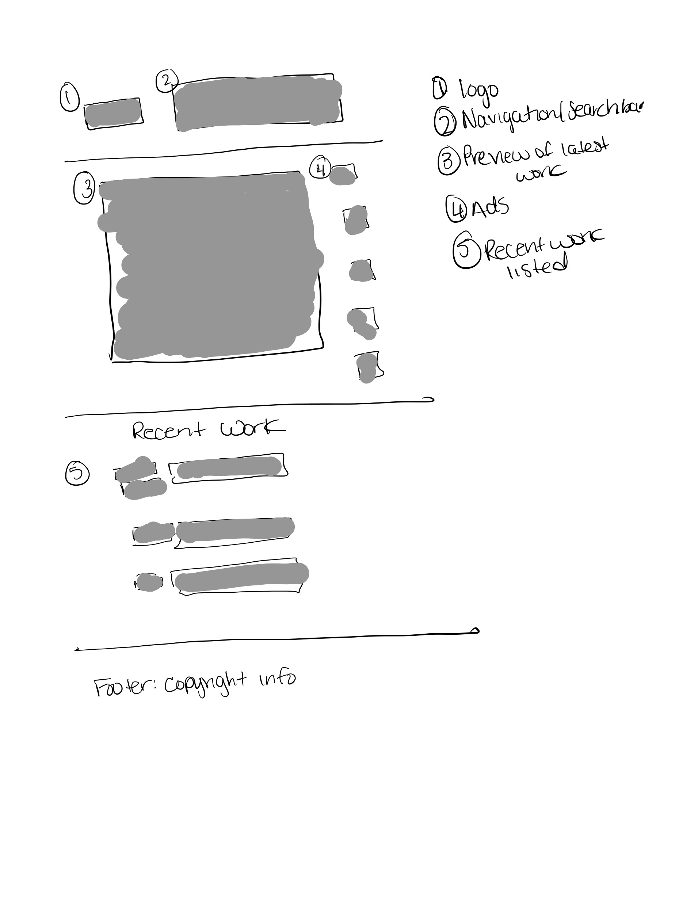
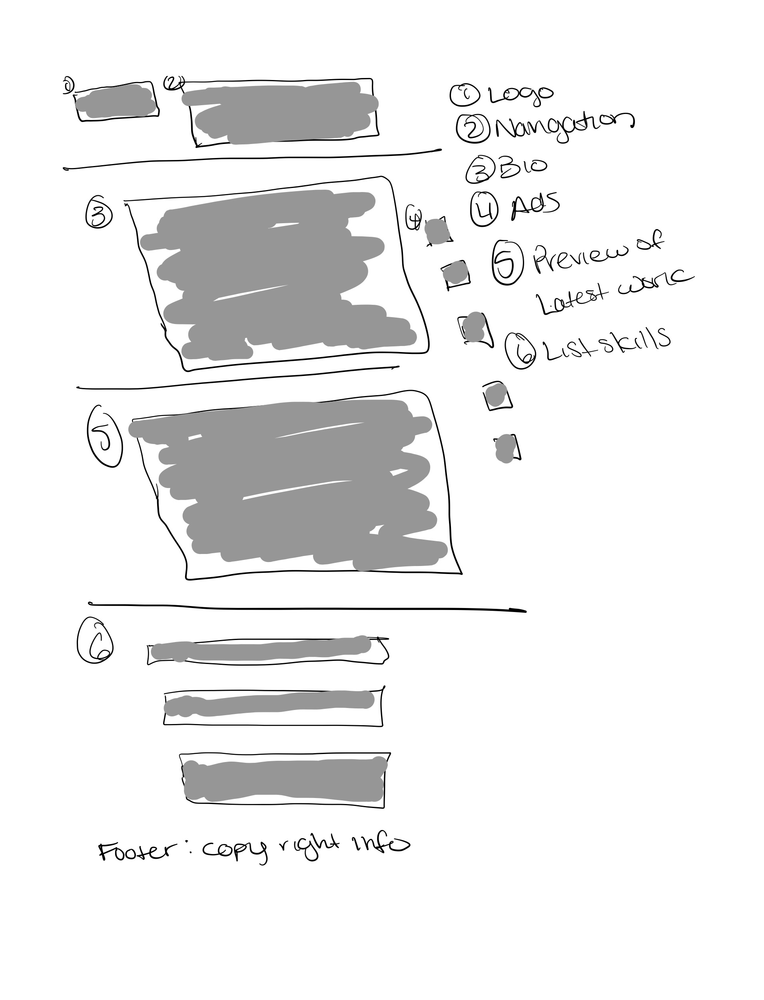

# Carla Sylvester's INF6420 Project

A portfolio site showcasing my work. 

## Wireframes

Header - will include LOGO and name of website

Navigation Menu - will include links to other pages like the about page and contact page

Main Content - will include recent work, ads, and preview of work

Footer - will include copyright information

Header - will include LOGO and name of website

Navigation Menu - will include links to other pages

Main Content - will include bio and picture and recent work

Footer - will include copyright information

Header - will include logo and name of website

Navigation menu - will include links to other pages

Main Contact - will include my contact information and a questionnaire form

Footer - will include copyright information
